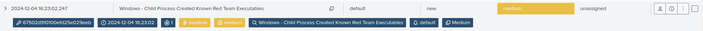

# User Account Changed

## User Attribute Modification Detection

### Event Description

* **Event ID 4738**: This event is logged whenever a user account is modified. It includes details of the modified account, the user or process that performed the modification, and the changes made. Monitoring this event is crucial to detect unauthorized or suspicious modifications to user accounts, such as privilege escalations or account lockout changes.

***

### Use Case Implementation

#### Steps to Simulate and Capture Logs



* **Simulating User Attribute Modification**:
  * Log in to a domain controller or a system with appropriate permissions.
  * Open **Active Directory Users and Computers (ADUC)**.
  * Locate an existing user account and modify one or more attributes (e.g., name, full name, email, phone number, group membership, or other user properties).
  * Save the changes and verify that **Event ID 4738** is generated in **Event Viewer** > **Windows Logs** > **Security**.
* **Manual Modification via GUI**:
  * Open the **Control Panel** or **Settings** on a system.
  * Navigate to user accounts and modify attributes such as account type or access permissions.
  * Confirm that the event is logged appropriately.



For example, we changed the user's full name.

```batch
net user testuser /fullname:"Test User"
```



For example, we disabled the Kerberos pre-authentication for the **testuser**

```powershell
Set-ADAccountControl -Identity testuser -DoesNotRequirePreAuth $true
```



***

### Event Viewer Logs

> Audit Success 28-11-2024 13:44:56 Microsoft Windows security auditing. 4738 User Account Management

***

### Splunk Queries


```splunk-spl
index="ad-ps-operational"  EventCode IN(4103,4104) (("Get-ADUser" AND "DoesNotRequirePreAuth") OR ("*Set-ADAccountControl*" AND "*DoesNotRequirePreAuth $true*"))
|table index sourcetype host EventCode Message |rename EventCode as event_code Message as message
```


***

### Splunk Logs

```
11/28/2024 11:58:09 AM
LogName=Security
EventCode=4738
EventType=0
ComputerName=WIN-3BK7E06Q35B.test.com
SourceName=Microsoft Windows security auditing.
Type=Information
RecordNumber=88954
Keywords=Audit Success
TaskCategory=User Account Management
OpCode=Info
Message=A user account was changed.

Subject:
	Security ID:		S-1-5-21-2889491314-2746541823-3071263440-500
	Account Name:		administrator
	Account Domain:		TEST
	Logon ID:		0x3CE13

Target Account:
	Security ID:		S-1-5-21-2889491314-2746541823-3071263440-1108
	Account Name:		testuser
	Account Domain:		TEST

Changed Attributes:
	SAM Account Name:	-
	Display Name:		-
	User Principal Name:	-
	Home Directory:		-
	Home Drive:		-
	Script Path:		-
	Profile Path:		-
	User Workstations:	-
	Password Last Set:	-
	Account Expires:		-
	Primary Group ID:	-
	AllowedToDelegateTo:	-
	Old UAC Value:		0x10
	New UAC Value:		0x10010
	User Account Control:	
		'Don't Require Preauth' - Enabled
	User Parameters:	-
	SID History:		-
	Logon Hours:		-

Additional Information:
	Privileges:		-
```

***

### Splunk Alert

<figure><figcaption><p>Alert Manager Dashboard in Expanded View</p></figcaption></figure>

***

### Sigma Rules

<details>

<summary>Account set with Kerberos pre-authentication not required (AS-REP Roasting)</summary>

```yaml
title: Account set with Kerberos pre-authentication not required (AS-REP Roasting)
description: Detects scenarios where an attacker set an account with Kerberos pre-authentication not required to perform offline brutforce. Account with this status can be checked with the following command > "Get-ADUser -Filter 'useraccountcontrol -band 4194304' -Properties useraccountcontrol".
references:
- https://github.com/mdecrevoisier/EVTX-to-MITRE-Attack/tree/master/TA0003-Persistence/T1098.xxx-Account%20manipulation
- https://social.technet.microsoft.com/wiki/contents/articles/23559.kerberos-pre-authentication-why-it-should-not-be-disabled.aspx
- https://docs.microsoft.com/en-us/services-hub/health/remediation-steps-ad/remove-the-highly-insecure-des-encryption-from-user-accounts
tags:
- attack.persistence
- attack.t1098
author: mdecrevoisier
status: experimental
logsource:
  product: windows
  service: security
detection:
  selection:
    EventID: 4738
    UserAccountControl: '%%2096' # Do not require Kerberos preauthentication - TRUE
  condition: selection
falsepositives:
- None
level: high
```


```splunk-spl
source=WinEventLog:Security AND (EventID="4738" AND UserAccountControl="%%2096")
```


</details>

<details>

<summary>Suspicious modification of a user account SPN to enable Kerberoast attack</summary>

```yaml
title: Suspicious modification of a user account SPN to enable Kerberoast attack
description: Detects scenarios where an attacker update the Service Principal Name (SPN) of a user account in order to enable Kerberoast attack and crack its password.
requirements: auditing SACL ("Write all properties") must be placed on the OU to monitor using the Active Directory console (https://www.manageengine.com/products/active-directory-audit/active-directory-auditing-configuration-guide-configure-object-level-auditing-manually.html).
references:
- https://github.com/mdecrevoisier/EVTX-to-MITRE-Attack/tree/master/TA0003-Persistence/T1098.xxx-Account%20manipulation
- https://docs.microsoft.com/en-us/windows/security/threat-protection/auditing/event-5136
- https://github.com/S1ckB0y1337/Active-Directory-Exploitation-Cheat-Sheet#force-set-spn
- https://docs.microsoft.com/en-us/troubleshoot/windows-server/windows-security/use-audit-active-directory-objects-track-events
tags:
- attack.persistence
- attack.t1098
author: mdecrevoisier
status: experimental
logsource:
  product: windows
  service: security
detection:
  selection:
    EventID: 5136 # ID 4738 doesn't report any changes about SPN changes
    AttributeLDAPDisplayName: servicePrincipalName
    ObjectClass: user
    OperationType: '%%14674' # Value is added
  filter:
    AttributeValue: '-'
  condition: selection and not filter
falsepositives:
- Rare administrator modifications on user objects
level: high
```


```splunk-spl
source=WinEventLog:Security AND (EventID="5136" AND AttributeLDAPDisplayName="servicePrincipalName" AND ObjectClass="user" AND OperationType="%%14674") AND  NOT (AttributeValue="-")
```


</details>

<details>

<summary>Account password set to never expire.</summary>

```yaml
title: Account password set to never expire.
description: Detects scenarios where an account password is set to never expire.
references:
- https://github.com/mdecrevoisier/EVTX-to-MITRE-Attack/tree/master/TA0003-Persistence/T1098.xxx-Account%20manipulation
tags:
- attack.persistence
- attack.t1098
author: mdecrevoisier
status: experimental
logsource:
  product: windows
  service: security
detection:
  selection:
    EventID: 4738
    UserAccountControl: '%%2089' # Account never expires - TRUE
  condition: selection
falsepositives:
- IAM solution, User Management solutions
level: medium
```


```splunk-spl
source=WinEventLog:Security AND (EventID="4738" AND UserAccountControl="%%2089")
```


</details>

<details>

<summary>Account marked as sensitive and cannot be delegated had its protection removed (weakness introduction)</summary>

```yaml
title: Account marked as sensitive and cannot be delegated had its protection removed (weakness introduction)
description: Detects scenarios where an attacker removes security protection from a sensitive account to escalate privileges
references:
- https://github.com/mdecrevoisier/EVTX-to-MITRE-Attack/tree/master/TA0003-Persistence/T1098.xxx-Account%20manipulation
- https://www.sans.org/blog/protecting-privileged-domain-accounts-safeguarding-access-tokens/
- https://www.cyberark.com/resources/threat-research-blog/weakness-within-kerberos-delegation
- https://book.hacktricks.xyz/windows/stealing-credentials/credentials-protections#protected-users
tags:
- attack.persistence
- attack.t1098
author: mdecrevoisier
status: experimental
logsource:
  product: windows
  service: security
detection:
  selection:
    EventID: 4738
    UserAccountControl: '%%2062' # Account is sensitive and cannot be delegated - FALSE
  condition: selection
falsepositives:
- none
level: high
```


```splunk-spl
source=WinEventLog:Security AND (EventID="4738" AND UserAccountControl="%%2062")
```


</details>

<details>

<summary>Account set with Kerberos DES encryption activated (weakness introduction)</summary>

```yaml
title: Account set with Kerberos DES encryption activated (weakness introduction)
description: Detects scenarios where an attacker set an account with DES Kerberos encryption to perform ticket brutforce.
references:
- https://github.com/mdecrevoisier/EVTX-to-MITRE-Attack/tree/master/TA0003-Persistence/T1098.xxx-Account%20manipulation
- https://docs.microsoft.com/en-us/services-hub/health/remediation-steps-ad/remove-the-highly-insecure-des-encryption-from-user-accounts
tags:
- attack.persistence
- attack.t1098
author: mdecrevoisier
status: experimental
logsource:
  product: windows
  service: security
detection:
  selection:
    EventID: 4738
    UserAccountControl: '%%2095' # Use only Kerberos DES encryption types - TRUE
  condition: selection
falsepositives:
- None
level: high
```


```splunk-spl
source=WinEventLog:Security AND (EventID="4738" AND UserAccountControl="%%2095")
```


</details>

<details>

<summary>Account set with password not required (weakness introduction)</summary>

```yaml
title: Account set with password not required (weakness introduction)
description: Detects scenarios where an attacker set an account with password not required to perform privilege escalation attack.
references:
- https://github.com/mdecrevoisier/EVTX-to-MITRE-Attack/tree/master/TA0003-Persistence/T1098.xxx-Account%20manipulation
- https://github.com/Azure/Azure-Sentinel/blob/master/Detections/SecurityEvent/password_never_expires.yaml
tags:
- attack.persistence
- attack.t1098
author: mdecrevoisier
status: experimental
logsource:
  product: windows
  service: security
detection:
  selection:
    EventID: 4738
    UserAccountControl: '%%2082' # User account with password set to not require - TRUE
  condition: selection
falsepositives:
- IAM solutions generating accounts
level: medium
```


```splunk-spl
source=WinEventLog:Security AND (EventID="4738" AND UserAccountControl="%%2082")
```


</details>

<details>

<summary>Account set with reversible encryption (weakness introduction)</summary>

```yaml
title: Account set with reversible encryption (weakness introduction)
description: Detects scenarios where an attacker set an account with reversible encryption to facilitate brutforce or cracking operations.
references:
- https://github.com/mdecrevoisier/EVTX-to-MITRE-Attack/tree/master/TA0003-Persistence/T1098.xxx-Account%20manipulation
- https://www.blackhillsinfosec.com/how-i-cracked-a-128-bit-password/
tags:
- attack.persistence
- attack.t1098
author: mdecrevoisier
status: experimental
logsource:
  product: windows
  service: security
detection:
  selection:
    EventID: 4738
    UserAccountControl: '%%2091' # Store password using reversible encryption - True
  condition: selection
falsepositives:
- None
level: high
```


```splunk-spl
source=WinEventLog:Security AND (EventID="4738" AND UserAccountControl="%%2091")
```


</details>

***

This documentation provides a clear structure to track and detect user attribute modifications. Let me know if adjustments are needed!
