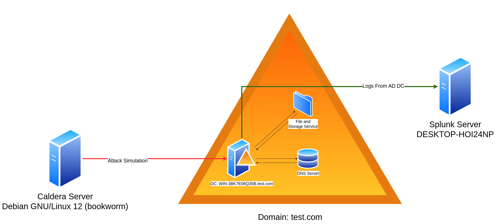

# Lab Architecture

In this section, we outline the primary tools and methods used to simulate, capture, and analyze Active Directory events, as well as the approach for implementing Splunk use cases. This blend of tools ensures a versatile environment for observing and understanding AD event logs across different scenarios.

### Tools

#### 1. **Splunk**

* **Purpose**: Primary tool for log analysis, query development, and creating detection use cases.
* **Role**: Aggregates log data from AD, allowing us to build and refine queries to detect key AD events.
* **Key Functions Used**:
  * **Search Processing Language (SPL)** for building custom queries.
  * **Alerts and Notifications** to monitor events in real-time.
  * **Dashboards** to visualize AD activity trends.

#### 2. **Caldera**

* **Purpose**: An automated adversary emulation platform used to simulate various AD attack scenarios.
* **Role**: Generates test cases for realistic adversarial behaviour within AD to observe log generation and detection.
* **Advantages**:
  * Reduces manual effort in generating repetitive test cases.
  * Provides flexibility in simulating complex scenarios that mimic real-world threats.

#### 3. **Windows PowerShell and Command Line**

* **Purpose**: Execute specific commands for manual simulation of AD events.
* **Role**: Allows for precise control over event generation, useful for tests that require step-by-step execution.
* **Examples**:
  * Commands to create/delete users, modify passwords, and change group memberships.
  * PowerShell scripts for advanced log generation and policy modifications.

#### 4. **Windows GUI**

* **Purpose**: Manual execution of AD tasks through the Windows graphical interface.
* **Role**: Ideal for generating logs associated with common administrative actions in AD, such as password changes and account modifications.
* **Examples**:
  * User account management through Active Directory Users and Computers (ADUC).
  * Group Policy Modifications via Group Policy Management Console (GPMC).

***

### Methodology

The methodology is structured around **event simulation, log capture, and detection rule creation** to ensure a complete detection lifecycle.

<figure><figcaption></figcaption></figure>

1. **Event Simulation**
   * We simulate events using a mix of **Caldera scripts**, **PowerShell/CLI commands**, and **manual GUI interactions**.
   * This multi-pronged approach provides comprehensive coverage of possible AD events and ensures we capture a wide variety of log data.
2. **Log Analysis and Categorization**
   * Logs are collected for each event simulation and analyzed for:
     * **Event IDs** and associated **log categories** (e.g., Security, System).
     * Important log attributes that can aid in distinguishing normal from suspicious activity.
   * We then map each event to the appropriate category and subcategory in Splunk.
3. **Splunk Detection and Use Case Development**
   * Each detected event type is structured into a **Splunk use case**.
   * **SPL queries** are created to filter, search, and detect events, while **alerts** are configured to trigger based on specific thresholds or anomalies.
   * **Dashboards and visualizations** are implemented to monitor events, providing real-time insights into AD activity.

***

### Lab System Configuration



**CPU**: Intel Core i-5 8365U (2vCPUs)\
**RAM**: 3GB 2400 MHz\
**Disk**: 50 GB (SSD)\
**Domain Function Level**: Windows Server 2016 \
**Forest Function Level**: Windows Server 2016&#x20;



**CPU**: Intel Core i-5 8365U (4vCPUs)\
**RAM**: 8GB 2400 MHz\
**Disk**: 512 GB (SSD)\
**OS**: Windows 11 Pro 23H2



**CPU**: AMD Ryzen 3 2200G (2vCPUs) \
**RAM**: 2 GB 3200MHz\
**Disk**: 8 GB (SSD)\
**OS**: Debian GNU/Linux 12 (bookworm)



***

This **Tools and Methodology** framework ensures a robust detection process, encompassing both standard administrative actions and adversarial simulations to build a resilient AD monitoring environment.
