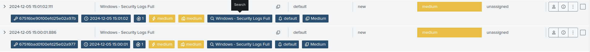

# Event Logging Service Shut Down

### Event Description

* **Event ID 1100**: This event is logged when the Windows Event Log service is stopped. Monitoring this event is crucial as it can indicate potential tampering or disruption of logging, which attackers may perform to cover their tracks.

***

### Use Case Implementation

#### Steps to Simulate and Capture Logs



* Open the **Services** console:
  * Press `Win + R`, type `services.msc`, and press **Enter**.
* Scroll down to find **Windows Event Log**.
* Right-click it and select **Stop**.



* Open CMD as an administrator.
*   Stop the Windows Event Log service using the `net` command:

    ```batch
    net stop "eventlog"
    ```

    * You may be prompted to confirm stopping dependent services.



* Open PowerShell as an administrator.
*   Stop the Windows Event Log service using the `Stop-Service` cmdlet:

    ```powershell
    Stop-Service -Name eventlog -Force
    ```




As **eventlog** is a system critical service, it is a complex way to stop the process as many other services depend on it. Best way is to restart the PC and 1100 will be triggered as the service will be stopped automatically during restart.



**Enable Auditing for Service Changes (if not already enabled):**

* Open the **Group Policy Management Editor**.
* Navigate to **Computer Configuration** > **Windows Settings** > **Security Settings** > **Advanced Audit Policy Configuration** > **System** > **Audit Other System Events**.
* Enable auditing for both success and failure.


***

### Event Viewer Logs

> Audit Success 02-12-2024 17:43:18 Eventlog 1100 Service shutdown

***

### Splunk Queries

```splunk-spl
index=ad-test EventCode=1100
| stats count by _time, EventCode, ComputerName, host, sourcetype
```

***

### Splunk Logs

```
12/02/2024 05:41:15 PM
LogName=Security
EventCode=1100
EventType=4
ComputerName=WIN-3BK7E06Q35B.test.com
SourceName=Microsoft-Windows-Eventlog
Type=Information
RecordNumber=120197
Keywords=Audit Success
TaskCategory=Service shutdown
OpCode=Info
Message=The event logging service has shut down.
```

### Splunk Alert

<figure><figcaption><p>Alert Manager Dashboard in Expanded View</p></figcaption></figure>

### References

1. [https://learn.microsoft.com/en-us/previous-versions/windows/it-pro/windows-10/security/threat-protection/auditing/event-1100](https://learn.microsoft.com/en-us/previous-versions/windows/it-pro/windows-10/security/threat-protection/auditing/event-1100)
2. [https://ss64.com/nt/net-service.html](https://ss64.com/nt/net-service.html)
3. [https://learn.microsoft.com/en-us/powershell/module/microsoft.powershell.management/stop-service?view=powershell-7.4](https://learn.microsoft.com/en-us/powershell/module/microsoft.powershell.management/stop-service?view=powershell-7.4)
